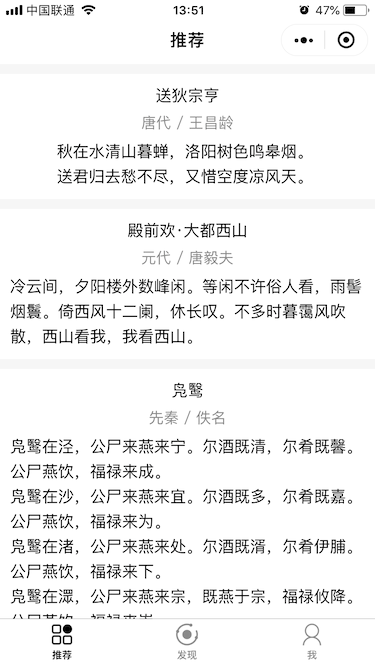
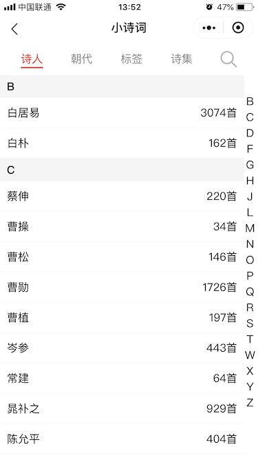
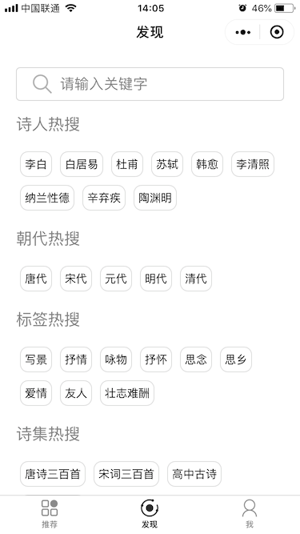

# vuepoems

> 使用Wepy框架来实现，并使用了腾讯云提供的云开发。
> 最大的特点使用Components来对页面进行拆分重用，使用数据绑定的方式更新页面。

> ### 技术要点
>
> * 使用for语法，以组件的方式展示诗词列表

> ### 技术要点
>
> * flex布局实现底部TabBar
> * 使用wx:if实现TabBar切换功能
> * Canvas图片生成
> * 使用iconfont显示收藏，分享，更多图标
> * 增加音频播放wx.getBackgroundAudioManager
> * 使用路由的方式跳转页面

> ### 技术要点
>
> * flex布局实现顶部TabBar
> * 使用wx:if实现TabBar切换功能
> * 实现字母索引
> * 使用wx:for实现标签列表

> ### 技术要点
>
> * flex布局实现标签自动换行

> ### 技术要点
>
> * 使用云开发记录用户收藏，浏览的诗词记录
> * 增加左滑删除记录

